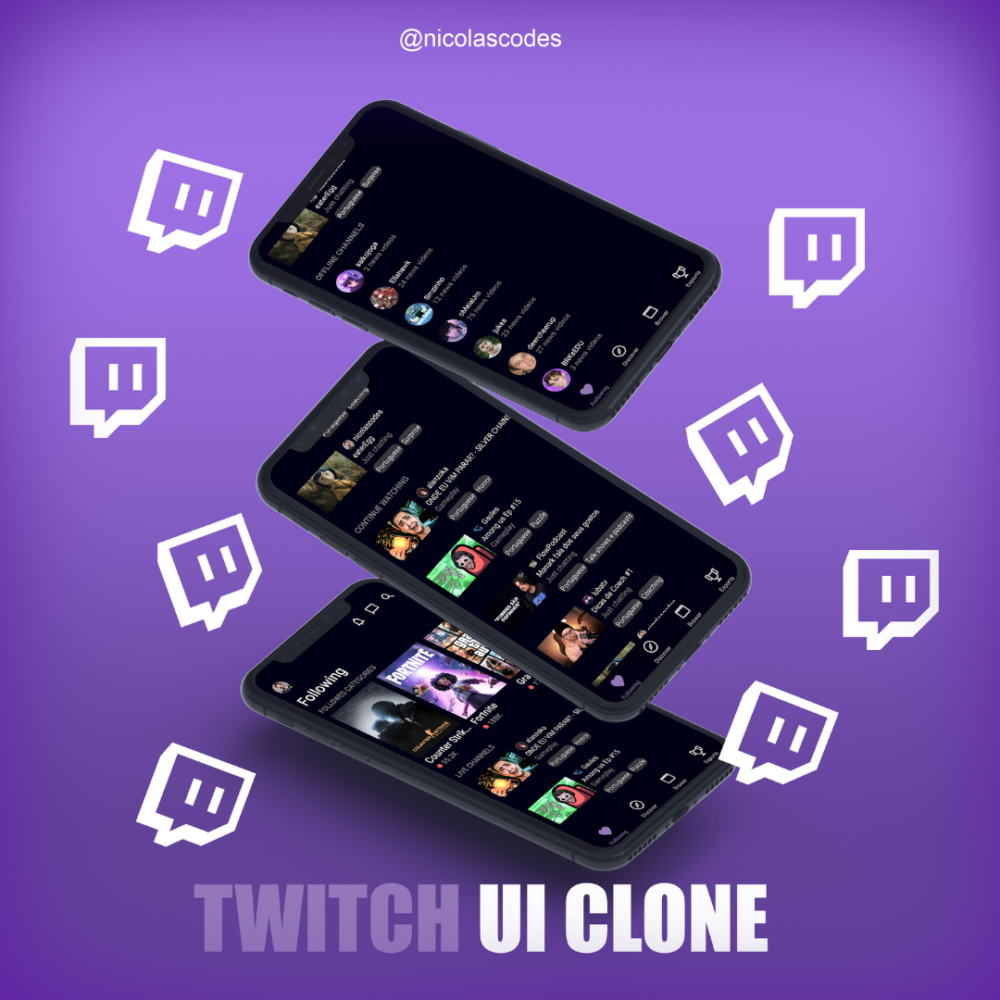
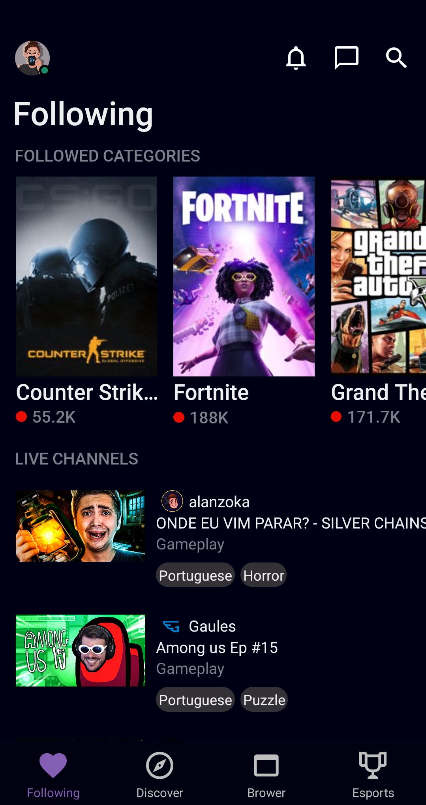
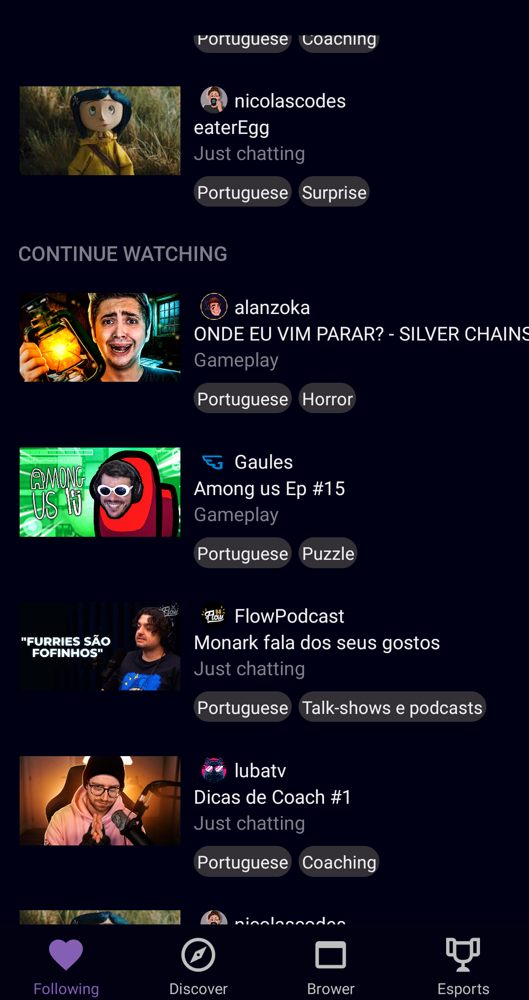
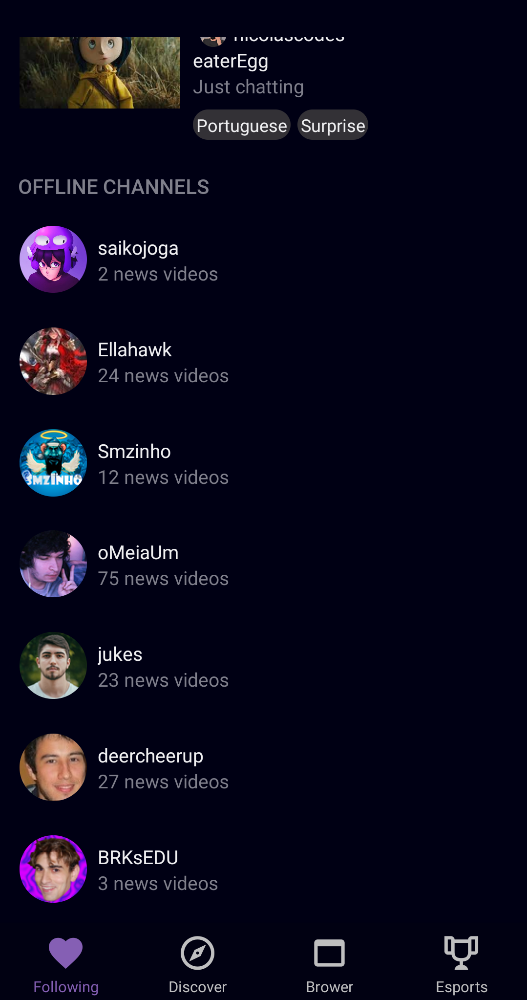

<h1 align="center">UI da Twitch.tv 
</h1>

<div>

</div>

<div class="box">

</div>
<div class="box">

</div>
<div class="box">

</div>

<style>
div.box {
	width: 150px;
	display: inline-block;
}
</style>

## **Sobre** 

_Foi algo mais para praticar mesmo o meu front, mas agora vendo o resultado eu gostei bastante e resolvi postar aqui =)_

## **Tecnologias usadas**

- React Native
- Navigations
- Styled-Components

## **Como baixar o projeto?** 


```bash
$ git clone https://github.com/nikorasucodes/twitchclone

$ cd twitchclone

$ yarn install

$ yarn start
```

### _Desenvolvido por:_ **Nicolas Sousa**